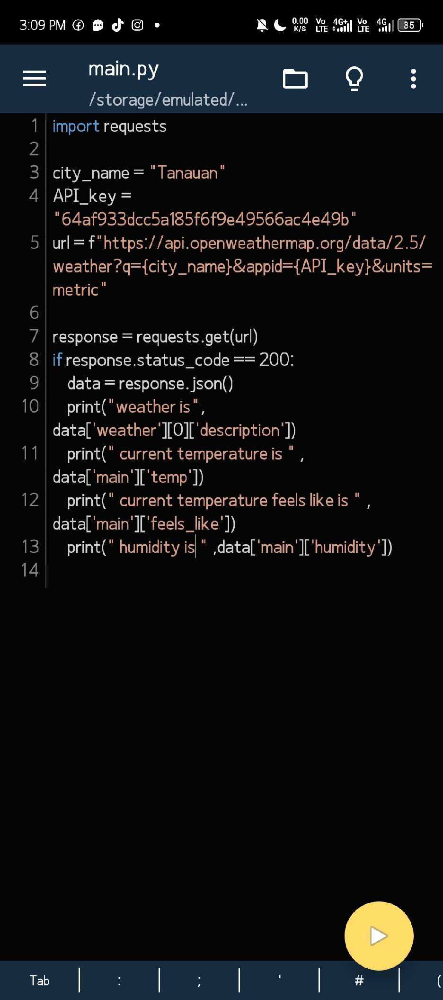
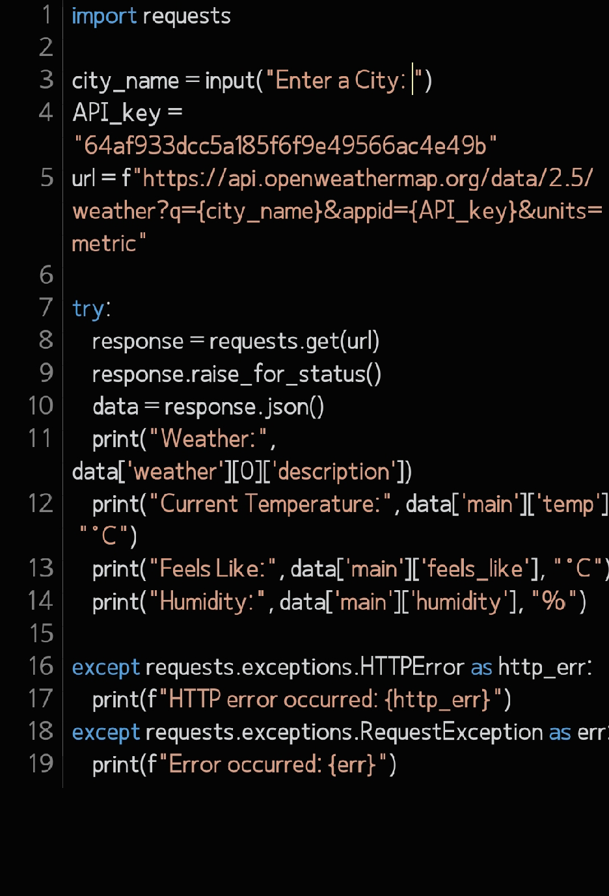
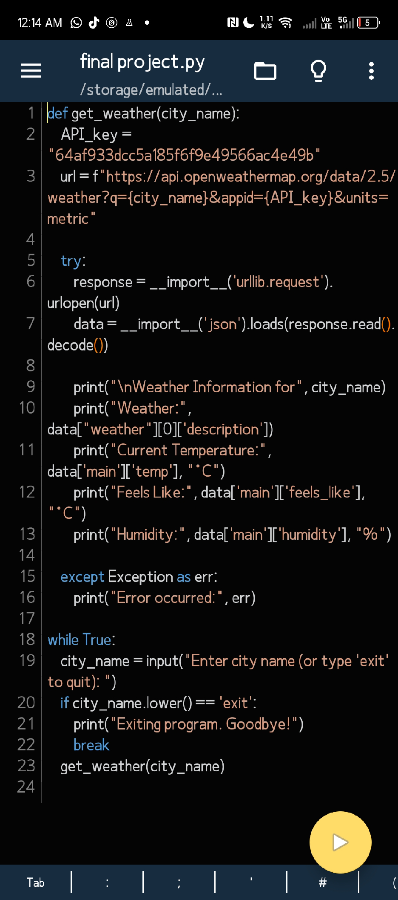

# 🚀 Project Development Journey

## 📅 Day 1: Initial Concept

On the first day of the project, I began by carefully thinking through the system I wanted to develop. My initial approach involved comprehensive research, exploring various examples of similar systems to gain valuable insights and inspiration for my own project.

## 🔍 Day 2: Research and Initial Coding

This day was dedicated to in-depth research and preliminary coding. I thoroughly investigated potential code approaches by exploring resources on YouTube and Google. After gathering sufficient information and understanding the potential implementation strategies, I started writing the initial code for the project.

## 🖥️ Day 3: Early Development Snapshot

## 🛡️ Day 4: Error Handling Implementation

A critical milestone in the project was the implementation of robust error handling mechanisms. By adding comprehensive error management, I significantly improved the system's reliability and stability. This step is crucial in preventing unexpected crashes and ensuring a smooth user experience.

## 📥 Day 5: Input and Output Management

During this phase, I focused on developing the input and output functionality. This crucial component enables seamless user interaction with the system, allowing for more dynamic and responsive user experiences.

## 🔄 Day 6: Loop and Import Optimization

I refined the code structure by introducing a while loop and streamlining the import statements. These modifications improved the overall code efficiency and readability, making the system more maintainable.

## 🌦️ Day 7: Weather Data Fetching System

A significant breakthrough came with the development of a sophisticated weather data retrieval system. The key features of this implementation include:

- Continuous user input loop for city selection
- Dynamic API request URL generation
- Weather data fetching using standard library methods
- Comprehensive JSON response parsing
- Detailed weather information display
- Robust error handling mechanisms
- User-friendly exit functionality

## 🔧 Day 8: Error Refinement

The final day of this development phase was dedicated to a meticulous review and refinement of existing errors. Through careful debugging and optimization, I improved the overall code quality and reliability.

## 🚀 Conclusion

This development journey represents a systematic approach to building a robust and functional system. Each day brought new challenges and insights, contributing to the project's gradual evolution and improvement.